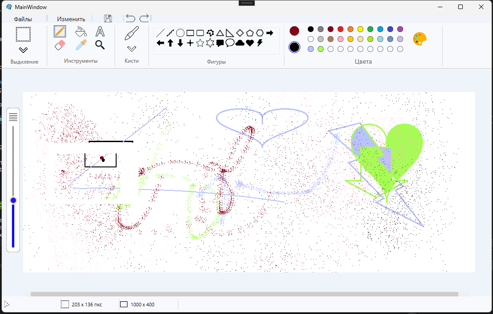

# PaintWPF

A Windows Paint clone built with C# and WPF. The goal was to recreate the look and feel of classic Windows Paint as closely as possible.

## Features

**Tools**
- Pencil, eraser, fill, color picker, magnifier, text
- Selection — rectangle, freeform, invert, transparent, delete

**Brushes**
- 9 brush types: default, calligraphic, pen, spray, oil, color pencil, marker, texture pencil, watercolor

**Shapes**
- Lines, arrows, rectangle, ellipse, triangle, diamond, pentagon, hexagon, star, heart, lightning and more

**Colors**
- Color palette with preset colors
- Custom color picker (RGB + HEX)
- Save custom colors

**File**
- New, Open, Save, Save As
- Import image to canvas
- Print, Send
- Set as desktop wallpaper
- Image properties

**Other**
- Undo / Redo
- Canvas size display in status bar

## Stack

- **C# / WPF** — UI and logic
- **CustomControls** — custom brush and shape controls

## Getting Started

1. Clone the repo and open `PaintWPF.sln` in Visual Studio
2. Restore NuGet packages
3. Hit F5
